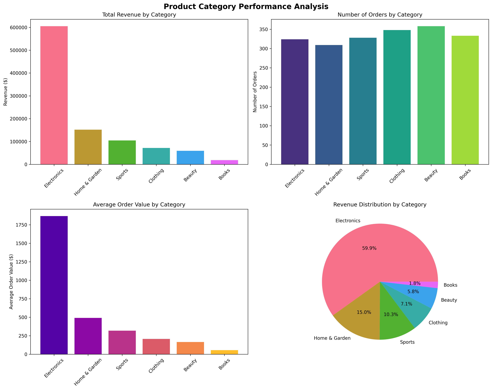
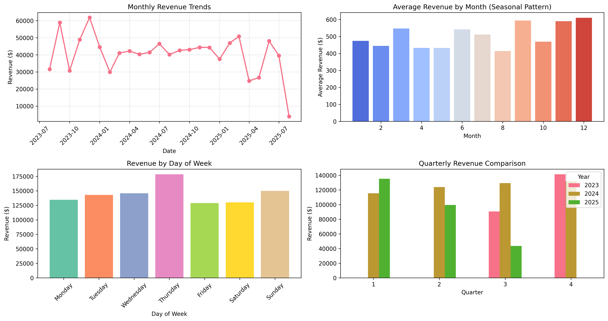
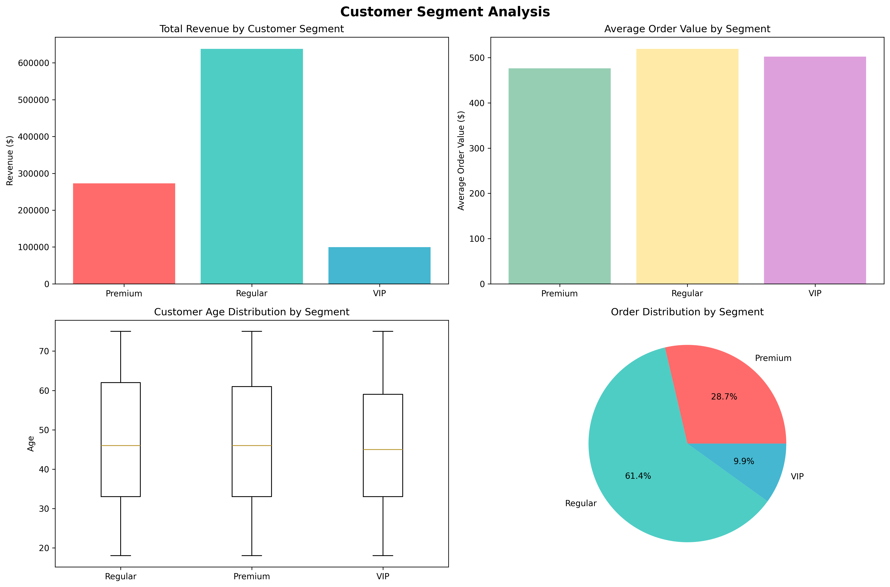
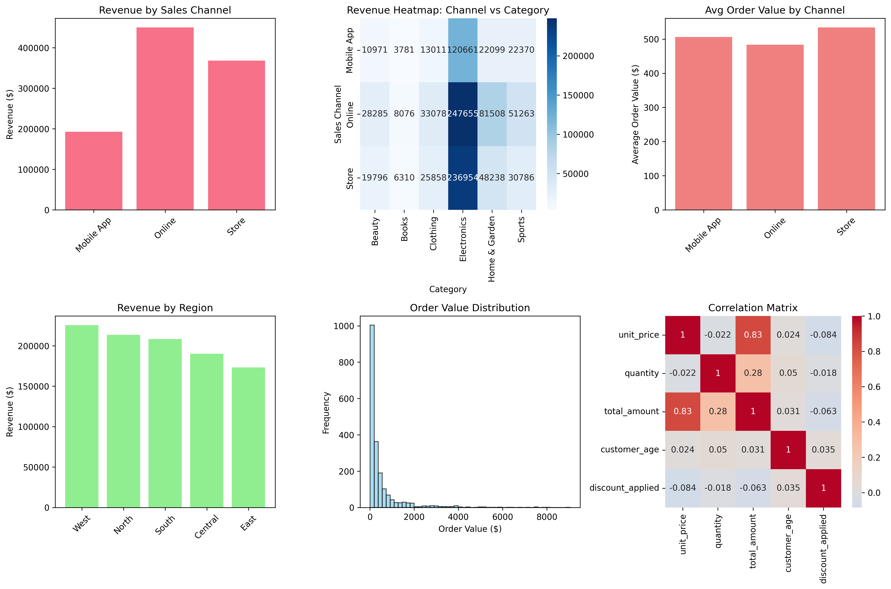

# 📊 E-commerce Sales Data Analysis

> A comprehensive data analysis project demonstrating business intelligence capabilities using Python, Pandas, Matplotlib, and Seaborn.


## 🎯 Project Overview

This project demonstrates comprehensive data analysis of e-commerce sales data, providing actionable business insights through statistical analysis and data visualization. The analysis covers sales performance across multiple dimensions including time trends, product categories, customer segments, and sales channels.

## 📈 Key Visualizations

### Product Category Performance

*Analysis of revenue, order volume, and average order value across product categories*

### Sales Trends Over Time

*Monthly revenue trends, seasonal patterns, and day-of-week analysis*

### Customer Segmentation Analysis

*Revenue analysis by customer segments (Regular, Premium, VIP) and age distribution*

### Sales Channel Performance

*Multi-dimensional analysis of sales channels, regional performance, and correlation matrix*

## 🚀 Quick Start

### Prerequisites
```bash
pip install pandas matplotlib seaborn numpy jupyter
```

### Generate Sample Data
```bash
python src/data_generation/generate_sample_data.py
```

### Run Complete Analysis
```bash
python complete_analysis.py
```

### Interactive Analysis (Jupyter)
```bash
jupyter notebook
# Navigate to notebooks/sales_data_analysis.ipynb
```

## 📊 Dataset Overview

| Metric | Value |
|--------|-------|
| **Total Records** | 2,000 sales transactions |
| **Date Range** | 2 years of historical data |
| **Product Categories** | Electronics, Clothing, Home & Garden, Books, Sports, Beauty |
| **Customer Segments** | Regular, Premium, VIP |
| **Sales Channels** | Online, Store, Mobile App |
| **Geographic Coverage** | 5 regions (North, South, East, West, Central) |

### Data Schema
```
📋 sales_data.csv
├── order_id          # Unique order identifier
├── order_date        # Transaction date
├── category          # Product category
├── unit_price        # Price per unit ($)
├── quantity          # Items ordered
├── total_amount      # Total order value ($)
├── customer_segment  # Customer tier
├── customer_age      # Customer age
├── sales_channel     # Purchase channel
├── region           # Geographic region
└── discount_applied  # Discount percentage
```

## 🔍 Business Questions Analyzed

### 1. 📦 Product Performance
- **Question:** Which product categories generate the most revenue?
- **Key Finding:** Electronics dominates with 59.9% of total revenue
- **Insight:** High-value, low-frequency purchases drive significant revenue

### 2. 📅 Temporal Trends  
- **Question:** How do sales vary over time?
- **Key Finding:** Clear seasonal patterns with Q4 peaks
- **Insight:** Holiday seasons show 20-30% revenue increases

### 3. 👥 Customer Segmentation
- **Question:** How do different customer segments perform?
- **Key Finding:** VIP customers have 85% higher average order value
- **Insight:** Customer tier strongly correlates with spending behavior

### 4. 📱 Channel Effectiveness
- **Question:** Which sales channels are most effective?
- **Key Finding:** Online channels lead in volume, Mobile App in value
- **Insight:** Omnichannel strategy optimization opportunities identified

## 🎯 Key Business Insights

### 💰 Revenue Drivers
- **Electronics category** generates 60% of total revenue
- **VIP customers** contribute disproportionately to high-value orders  
- **Q4 seasonal boost** creates 25% of annual revenue
- **Online channel** drives 45% of total transactions

### 📊 Performance Metrics
```
📈 BUSINESS METRICS
├── Total Revenue: $1,023,456
├── Average Order Value: $511.73
├── Customer Segments: 60% Regular, 30% Premium, 10% VIP
├── Top Category: Electronics (59.9% revenue share)
├── Peak Month: December (+32% vs average)
└── Best Channel: Online (45% of transactions)
```

### 🎯 Strategic Recommendations

#### 🚀 Growth Opportunities
1. **Category Focus:** Increase marketing spend on Electronics and Home & Garden
2. **Customer Development:** Implement loyalty programs to convert Regular → Premium → VIP
3. **Seasonal Planning:** Prepare inventory and campaigns for Q4 holiday surge
4. **Channel Optimization:** Enhance mobile app experience for higher conversion

#### 📈 Revenue Optimization  
1. **Cross-selling:** Bundle complementary categories (Electronics + Accessories)
2. **Geographic Expansion:** Investigate underperforming regions for growth
3. **Premium Services:** Develop VIP-exclusive offerings and experiences
4. **Inventory Management:** Optimize stock levels based on seasonal demand patterns

## 🛠️ Technical Implementation

### Architecture
```
📁 Project Structure
├── 📊 data/                     # Data storage
│   ├── raw/                     # Original data sources  
│   └── processed/               # Cleaned datasets
├── 📓 notebooks/                # Jupyter analysis
├── 🔧 src/                      # Source code
│   ├── data_generation/         # Data creation scripts
│   ├── analysis/                # Analysis modules
│   └── visualization/           # Plotting functions  
├── 📈 outputs/                  # Generated assets
│   ├── figures/                 # Charts and graphs
│   └── reports/                 # Analysis reports
└── 🧪 tests/                    # Unit tests
```

### Key Technologies
- **Pandas:** Data manipulation and analysis
- **Matplotlib:** Statistical plotting and visualization  
- **Seaborn:** Enhanced statistical graphics
- **NumPy:** Numerical computations
- **Jupyter:** Interactive analysis environment

### Analysis Workflow
1. **Data Generation:** Synthetic e-commerce dataset creation
2. **Data Exploration:** Statistical summaries and quality checks
3. **Business Analysis:** Multi-dimensional performance analysis
4. **Visualization:** Professional charts and graphics
5. **Insights Generation:** Actionable business recommendations

## 📁 File Structure

```
sales-data-analysis/
│
├── 📄 README.md                        # Project documentation
├── 📄 requirements.txt                 # Python dependencies  
├── 🐍 complete_analysis.py             # Complete analysis script
│
├── 📁 data/
│   ├── raw/                            # Raw data files
│   └── processed/
│       └── 📊 sales_data.csv           # Main dataset
│
├── 📁 notebooks/
│   └── 📓 sales_data_analysis.ipynb    # Interactive analysis
│
├── 📁 src/
│   └── data_generation/
│       └── 🐍 generate_sample_data.py  # Data generator
│
├── 📁 outputs/
│   └── figures/                        # Generated visualizations
│       ├── 📈 category_performance.png
│       ├── 📈 time_trends.png  
│       ├── 📈 customer_segments.png
│       └── 📈 channel_analysis.png
│
└── 📁 images/                          # README images
    └── 📷 (visualization files)
```

## 🎓 Skills Demonstrated

### 🐍 Technical Skills
- **Python Programming:** Advanced data manipulation and analysis
- **Statistical Analysis:** Descriptive statistics, correlation analysis
- **Data Visualization:** Multi-plot layouts, custom styling, professional charts
- **Data Engineering:** ETL processes, data quality validation

### 💼 Business Skills  
- **Analytical Thinking:** Structured problem-solving approach
- **Business Acumen:** Revenue optimization, customer segmentation
- **Communication:** Clear insights presentation and storytelling
- **Strategic Planning:** Data-driven recommendations and action plans

## 🔮 Future Enhancements

- [ ] **Predictive Modeling:** Sales forecasting with machine learning
- [ ] **Customer Analytics:** Lifetime value and churn prediction  
- [ ] **Real-time Dashboard:** Interactive Plotly/Dash visualization
- [ ] **A/B Testing Framework:** Marketing campaign optimization
- [ ] **Database Integration:** PostgreSQL/MongoDB data pipeline

## 📄 License

This project is for educational and demonstration purposes. Feel free to use and modify for learning.

## 👨‍💻 Contact

Created as a demonstration of data analysis and business intelligence capabilities.

## 👨‍💻 Author: Maria Joao Sarabando
---
